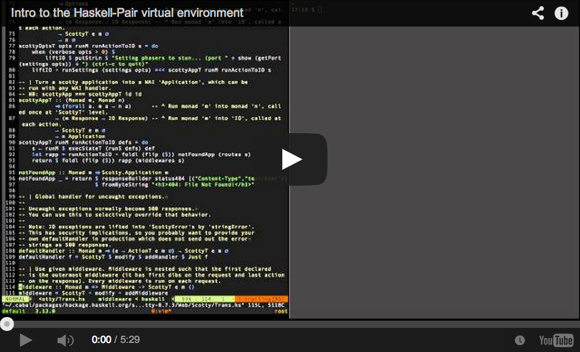

<p align="center">
  <a href="https://begriffs.com/posts/2014-06-09-pair-programming-with-haskell-and.html"></a>
</p>

## Installation

### on a local virtualbox

1. Clone this repo
1. Install [Vagrant](http://www.vagrantup.com/) and [VirtualBox](https://www.virtualbox.org/)
1. `vagrant up`
1. `vagrant ssh`

This will create a clean dev environment with the newest GHC and
Cabal.  It also includes
[haskell-vim-now](https://github.com/begriffs/haskell-vim-now), a
vim configured to be a Haskell IDE.

### on a public pair programming server

1. Clone this repo
1. Install [Vagrant](http://www.vagrantup.com/)
1. Sign up at [DigitalOcean](https://www.digitalocean.com/)
1. Fill out your DigitalOcean client ID and API key in `Vagrantfile`
1. `vagrant plugin install vagrant-digitalocean`
1. `vagrant box add digital_ocean https://github.com/smdahlen/vagrant-digitalocean/raw/master/box/digital_ocean.box`
1. `vagrant up --provider=digital_ocean`
1. `vagrant ssh`

You'll be logged in to a newly created DigitalOcean "droplet."

ps: for some reason I had to create a ssh key with a password otherwise
I could not get ssh access to the box

## Included software

1. Ubuntu 16.04
1. New GHC via Stack
1. [haskell-vim-now](https://github.com/begriffs/haskell-vim-now)
1. [SixArm git config](https://github.com/SixArm/sixarm_git_gitconfig)
1. Firewall, hardened OpenSSH, Fail2ban
1. Oh My ZSH, Tmux/wemux
1. Mumble voice chat server (port 64738)

## Pairing

To pair program with someone you can give them login access by
running

```sh
pair github_name
```

They connect to your server by `ssh-add`'ing their Github SSH key
and running `ssh friend@[your-server-ip]`.

When you're done working with them, run

```sh
unpair
```

## Tmux Keybindings

<table>
<tbody>
  <tr>
    <td>C-a |</td><td>Split vertically</td>
  </tr>
  <tr>
    <td>C-a _</td><td>Split horizontally</td>
  </tr>
  <tr>
    <td>C-h</td><td>Move to leftward pane</td>
  </tr>
  <tr>
    <td>C-l</td><td>Move to rightward pane</td>
  </tr>
  <tr>
    <td>C-j</td><td>Move to downward pane</td>
  </tr>
  <tr>
    <td>C-k</td><td>Move to upward pane</td>
  </tr>
  <tr>
    <td>C-a [</td><td>Detach cursor to scroll (ENTER stops)</td>
  </tr>
  <tr>
    <td>C-a c</td><td>Create new window</td>
  </tr>
  <tr>
    <td>C-a [0-9]</td><td>Switch to numbered window</td>
  </tr>
</tbody>
</table>


## Publishing a bare git repo to export work (safest)

To safely write code in the pairing environment and then export it to
some kind of github account, you'll probably want to create a
bare-repo locally on the pairing server, push your development to that,
and then pull your new work onto your safe local development laptop,
where you can then push it to your gitlab/ github server safely.


###### On Pairing Server
```
# Creating a bare repo, a safe portal allowing code to flow into safer places
$ sudo mkdir /pairing && sudo chown ${USER} /pairing
$ mkdir /pairing/my_project && cd "$_"
$ git init --bare

```

###### On Your Local System
```
# Push the code to the remote
$ git remote add pairing-server:/pairing/my_project
$ git push pairing-server master
```

###### On Pairing Server
```
# Clone the bare repo, and start hacking
$ mkdir ~/dev && cd ~/dev
$ git clone /pairing/my_project
$ cd my_project

$ echo 'hi' >> README.md && git add . && git commit -m "adds a thing"
$ git push origin master # it's now waiting in the portal :)
```

###### On Your Local System
```
# Collect the new code
$ git pull pairing-server master
```


## SSH agent forwarding (for use with trusted pairs)

If both parties trust each other, then user agent forwarding can be
enabled to allow convienient access to your github repos through the
pairing server.  But if trust has not been established, forwarding
your user agent can potentially allow one of the pairs usage of all
the private keys in your local machine's user agent, and these keys
could potentially be misused to access remote machines or delete
github repos, etc, etc.

Understanding the
[risks](https://www.clockwork.com/news/2012/09/28/602/ssh_agent_hijacking),
to access your github repos on the pairing server use agent forwarding.

Edit your local `~/.ssh/config` file and add an entry for your
pair server host.
```
Host [ip address]
  ForwardAgent yes
```

Before ssh'ing into the pairing server run
```sh
ssh-add ~/.ssh/[keyname]
```
and it will be available remotely. To test agent forwarding run
this remotely
```sh
ssh -T git@github.com
```
